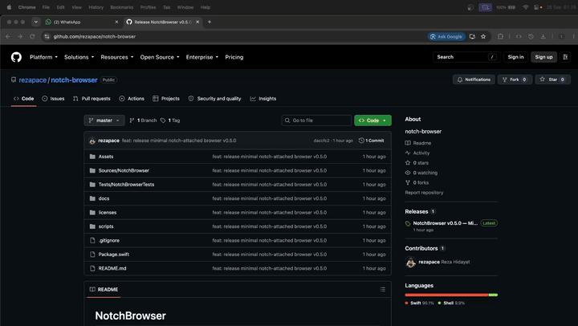

# NotchBrowser — Browser Minimal untuk Notch MacBook

NotchBrowser adalah browser minimal untuk macOS yang menyatu dengan notch MacBook. Arahkan kursor ke notch untuk membuka pratinjau, lalu klik panel untuk menjelajah. Browser mengembang dari panel yang sama dan tetap menempel di bagian atas layar—bukan membuka window browser terpisah.

> NotchBrowser adalah aplikasi **native macOS berbasis Swift, AppKit, dan WebKit**. Ini bukan browser terminal/TUI, aplikasi Go, atau browser Linux.



## Fitur

- **Panel menyatu dengan notch:** compact notch dan browser expanded menggunakan satu panel yang sama.
- **Pratinjau saat hover:** membuka browser tanpa mengambil fokus keyboard; klik untuk mulai berinteraksi.
- **Tab sederhana:** tambah, pilih, dan tutup tab. Tab dan halaman tetap hidup saat panel dikecilkan.
- **Navigasi web:** kolom URL/pencarian, previous, next, dan reload.
- **Kontrol auto-hide:** tab (+/×), URL, previous, dan next tersembunyi saat membaca halaman, tanpa mengubah ukuran viewport.
- **Tema gelap:** sudut bawah lebih rounded, tepi tipis, dan konten aman dari kamera.
- **Pintasan keyboard:** kontrol utama tersedia tanpa menambah toolbar yang ramai.
- **Layar tanpa notch:** panel ditempatkan di tengah tepi atas layar utama.

## Unduh

Unduh **[NotchBrowser.dmg](https://github.com/rezapace/notch-browser/releases/latest/download/NotchBrowser.dmg)** dari [GitHub Releases](https://github.com/rezapace/notch-browser/releases). Build rilis saat ini tersedia untuk **Apple Silicon (arm64), macOS 13+**.

Aplikasi menggunakan ad-hoc signing dan **belum dinotariskan oleh Apple**. Jika macOS memblokirnya, baca [petunjuk instalasi](docs/usage.md#instalasi) dan lanjutkan hanya jika Anda mempercayai sumber unduhan.

## Instalasi

1. Unduh dan buka `NotchBrowser.dmg`.
2. Seret `NotchBrowser.app` ke **Applications**.
3. Eject DMG, lalu jalankan aplikasi dari Applications.

Keluar dari versi lama dengan **⌘Q** sebelum mengganti aplikasi. Untuk detail keamanan instalasi dan penggunaan, lihat [panduan penggunaan](docs/usage.md).

## Build dari source

### Persyaratan

- Mac dengan macOS 13 atau lebih baru.
- Swift 5.9 atau lebih baru.
- Apple Command Line Tools (`xcode-select --install` jika belum tersedia).
- Sesi desktop macOS untuk tes yang menampilkan window.

Xcode GUI, npm, dan dependensi yang diunduh dari jaringan tidak diperlukan.

### Build dan jalankan

Dari root repository:

```sh
git clone https://github.com/rezapace/notch-browser.git
cd notch-browser
./scripts/build.sh
open dist/NotchBrowser.app
```

Script membangun release, menyiapkan app bundle dan ikon, menyalin resource, melakukan ad-hoc signing, lalu memverifikasi signature dan resource. Hasilnya berada di `dist/NotchBrowser.app`. Build mengikuti arsitektur Mac yang digunakan dan bukan universal binary.

Untuk membuat installer DMG:

```sh
./scripts/dmg.sh
open dist/NotchBrowser.dmg
```

Penjelasan lengkap tentang script build, resource, dan packaging ada di [panduan pengembangan](docs/development.md).

## Penggunaan dan pintasan

Arahkan kursor ke notch selama sekitar **120 ms** untuk membuka pratinjau. Klik browser untuk mulai mengetik atau berinteraksi dengan halaman. Keluar dari pratinjau yang belum diklik akan mengecilkan panel setelah jeda singkat.

Kontrol muncul kembali saat hover tepi atas area halaman atau **⌘L**. Pilih **View → Always Show Controls** jika ingin kontrol tetap terlihat.

| Pintasan | Fungsi |
| --- | --- |
| ⌘L | Tampilkan kontrol dan fokus ke kolom alamat |
| ⌘T | Buka tab baru |
| ⌘W | Tutup tab saat ini |
| ⌘1–⌘9 | Pilih tab |
| ⌘[ / ⌘] | Kembali / maju |
| ⌘R | Muat ulang halaman |
| Escape di kolom alamat | Batalkan edit dan kembali ke halaman |
| ⇧⌘W | Kecilkan browser ke notch |
| ⌘Q | Keluar dari aplikasi |

Teks yang tampak seperti alamat URL dibuka sebagai situs; teks lainnya dikirim sebagai pencarian Google setelah Enter. Lihat [panduan penggunaan](docs/usage.md#kontrol-dan-pintasan) untuk perilaku lengkap.

## Data dan batasan

- Website dirender oleh WebKit. Cookie, cache HTTP, dan penyimpanan website mengikuti persistent website store WebKit.
- NotchBrowser tidak menyediakan antarmuka history atau bookmark, dan tidak mengirim request autocomplete atau favicon tambahan.
- Tab tetap hidup saat panel dikecilkan, tetapi **belum dipulihkan setelah aplikasi keluar dan dibuka kembali**.
- Halaman tersembunyi belum disuspend otomatis, sehingga dapat terus menjalankan JavaScript atau audio.
- Beberapa perilaku terkait IME, dialog, Spaces/fullscreen, notch fisik, dan monitor eksternal masih perlu pengujian perangkat.

Baca [catatan privasi dan batasan](docs/usage.md#data-dan-jaringan) sebelum menggunakan aplikasi.

## Pengembangan dan pengujian

Jalankan tes mandiri:

```sh
./scripts/test.sh
```

Untuk tes beserta build dan validasi resource app bundle:

```sh
./scripts/test.sh --bundle
```

Tes window memerlukan sesi desktop macOS dan dapat menampilkan panel sementara. Detail coverage dan checklist manual tersedia di [panduan pengujian](docs/testing.md).

## Dokumentasi

- [Penggunaan](docs/usage.md) — instalasi, pintasan, data, dan batasan.
- [Pengembangan](docs/development.md) — persyaratan, build app/DMG, dan resource.
- [Arsitektur](docs/architecture.md) — panel tunggal, geometri, hover, fokus, dan lifecycle.
- [Pengujian](docs/testing.md) — tes otomatis dan validasi distribusi.
- [Performa](docs/performance.md) — optimisasi UI, GPU/cache WebKit, dan pengukuran dengan `./scripts/perf.sh`.
- [Lisensi komponen](licenses/THIRD_PARTY_NOTICES.md) — atribusi dan lisensi komponen.

## Kontribusi dan laporan masalah

Laporan bug, saran, dan kontribusi dipersilakan melalui [GitHub Issues](https://github.com/rezapace/notch-browser/issues) dan pull request. Sertakan versi macOS, arsitektur, konfigurasi monitor, langkah reproduksi, serta hasil build/test yang relevan. Jangan sertakan URL privat, cookie, atau data login.

## Lisensi

Lihat [notices dan lisensi komponen](licenses/THIRD_PARTY_NOTICES.md) untuk informasi lisensi dan atribusi.
